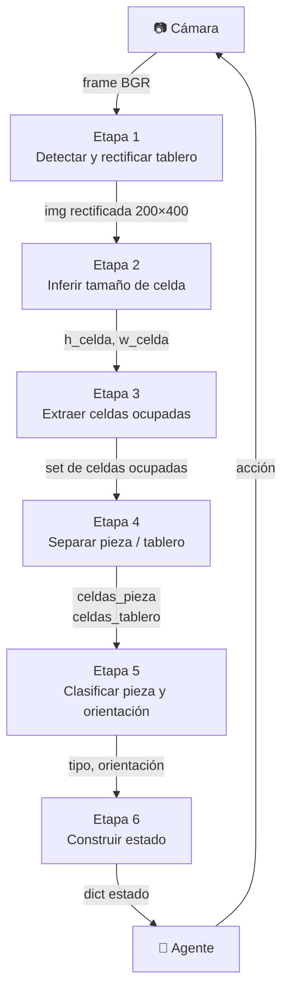
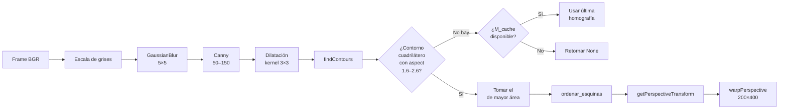
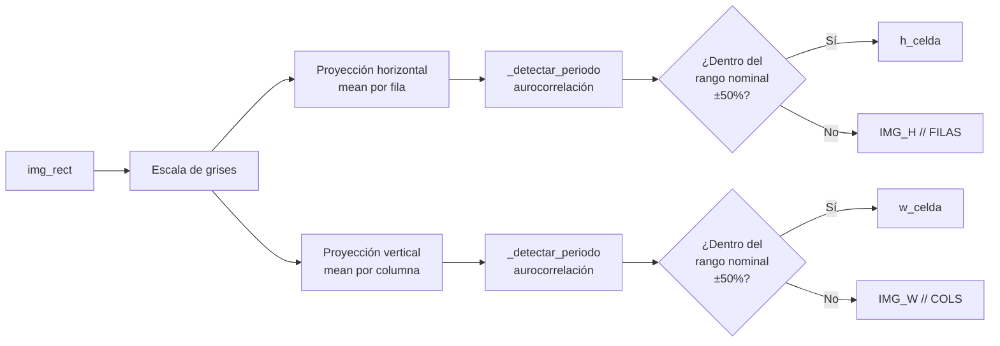
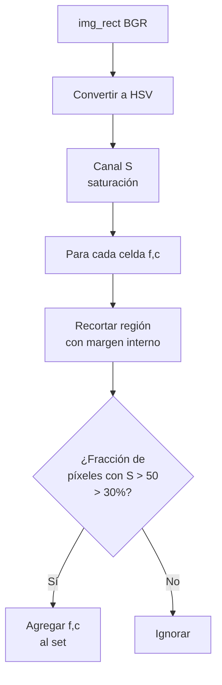
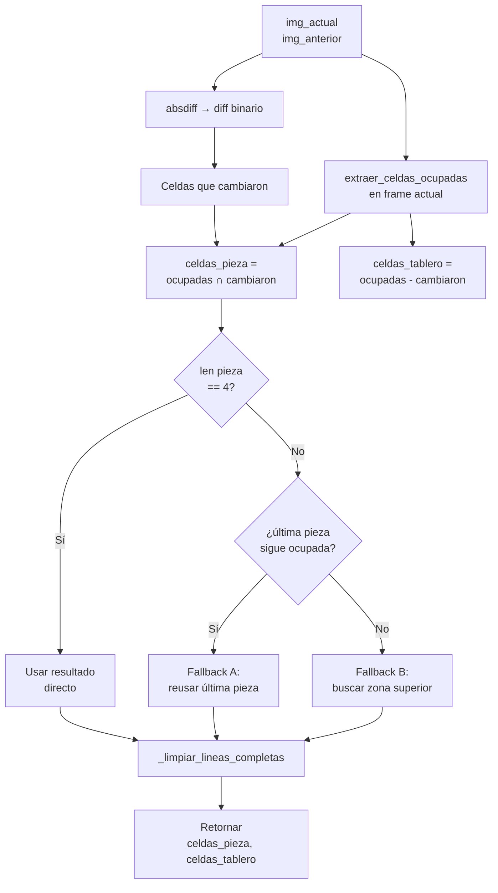
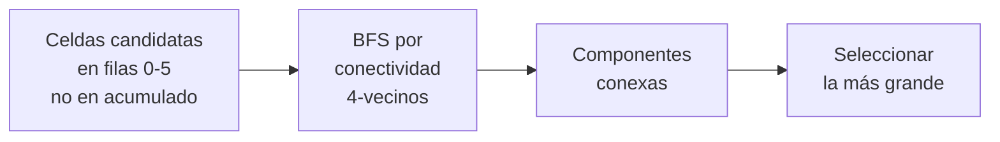
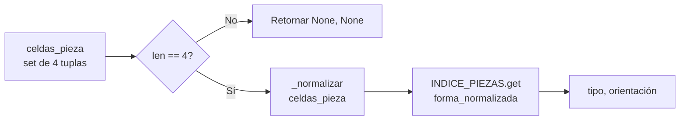
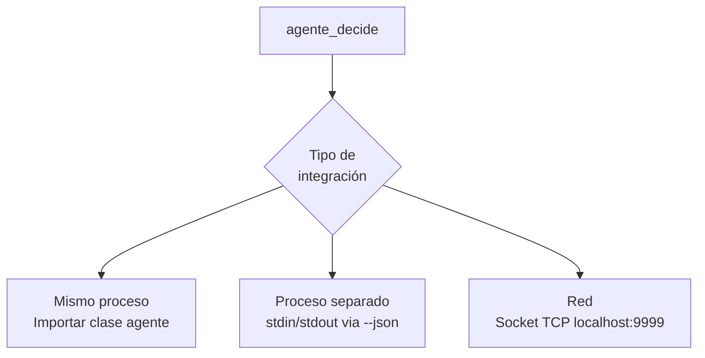
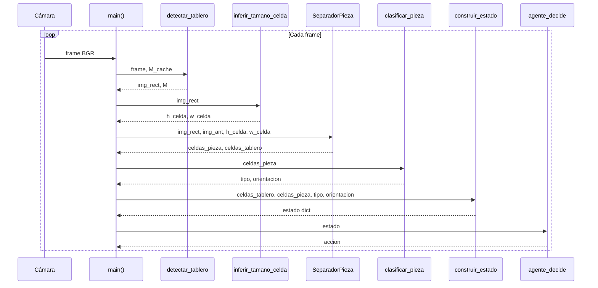
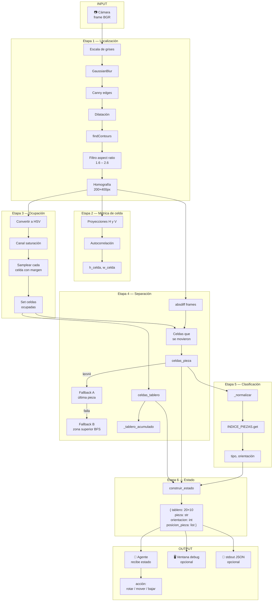

# tetris_vision.py — Documentación técnica

Sistema de visión por computadora que extrae el estado de un juego de Tetris
a partir de video de cámara y lo entrega a un agente decisor.

---

## Índice

1. [Arquitectura general](#1-arquitectura-general)
2. [Constantes y configuración](#2-constantes-y-configuración)
3. [Definición de piezas](#3-definición-de-piezas)
4. [Etapa 1 — Detección y rectificación del tablero](#4-etapa-1--detección-y-rectificación-del-tablero)
5. [Etapa 2 — Inferencia del tamaño de celda](#5-etapa-2--inferencia-del-tamaño-de-celda)
6. [Etapa 3 — Extracción de celdas ocupadas](#6-etapa-3--extracción-de-celdas-ocupadas)
7. [Etapa 4 — Separación pieza/tablero (`SeparadorPieza`)](#7-etapa-4--separación-piezatablero-separadorp ieza)
8. [Etapa 5 — Clasificación de pieza y orientación](#8-etapa-5--clasificación-de-pieza-y-orientación)
9. [Etapa 6 — Construcción del estado](#9-etapa-6--construcción-del-estado)
10. [Agente decisor](#10-agente-decisor)
11. [Visualización debug](#11-visualización-debug)
12. [Loop principal](#12-loop-principal)
13. [Argumentos de línea de comandos](#13-argumentos-de-línea-de-comandos)
14. [Flujo de datos completo](#14-flujo-de-datos-completo)

---

## 1. Arquitectura general

El sistema procesa cada frame de cámara de forma independiente a través de
un pipeline secuencial de seis etapas. La única excepción es la separación
pieza/tablero, que necesita memoria entre frames para detectar movimiento.



---

## 2. Constantes y configuración

Todas las constantes están al inicio del archivo para facilitar su ajuste
sin tocar el resto del código.

| Constante           | Valor     | Descripción                                                    |
| ------------------- | --------- | -------------------------------------------------------------- |
| `FILAS`             | 20        | Filas del tablero                                              |
| `COLS`              | 10        | Columnas del tablero                                           |
| `PX_CELDA`          | 20        | Píxeles por celda en la imagen rectificada                     |
| `IMG_W`             | 200       | Ancho de la imagen canónica (COLS × PX_CELDA)                  |
| `IMG_H`             | 400       | Alto de la imagen canónica (FILAS × PX_CELDA)                  |
| `MIN_SATURACION`    | 50        | Saturación HSV mínima para celda ocupada                       |
| `MIN_OCUPACION`     | 0.30      | Fracción de píxeles saturados que activa una celda             |
| `UMBRAL_DIFF`       | 20        | Diferencia de intensidad entre frames para detectar movimiento |
| `FILAS_ZONA_ACTIVA` | 6         | Filas superiores usadas en el fallback de posición             |
| `ASPECT_MIN/MAX`    | 1.6 / 2.6 | Rango de aspect ratio (alto/ancho) del tablero                 |
| `MARGEN_CELDA`      | 2         | Píxeles de margen interior al samplear cada celda              |

---

## 3. Definición de piezas

### `PIEZAS_ROTACIONES`

Diccionario que mapea cada tipo de pieza a su lista de rotaciones.
Cada rotación es una tupla de 4 pares `(fila, col)` relativas a la
esquina superior izquierda del bounding box de la pieza.

```
I  rot0: □□□□    I  rot1: □
                           □
                           □
                           □

T  rot0: _□_    T  rot1: □_    T  rot2: □□□   T  rot3: _□
         □□□             □□             _□_            □□
                          □_                            □
```

### `_normalizar(celdas)`

Traslada cualquier conjunto de celdas para que el mínimo de fila y columna
sea 0, y las ordena. Esto permite comparar formas independientemente de
su posición absoluta en el tablero.

```
(3,5),(3,6),(4,5),(4,6)  →  _normalizar  →  (0,0),(0,1),(1,0),(1,1)  ≡ pieza O
```

### `INDICE_PIEZAS`

Índice invertido construido en tiempo de importación:

```
forma_normalizada  →  (tipo, índice_rotación)
(0,0),(0,1),(1,0),(1,1)  →  ('O', 0)
(0,0),(0,1),(0,2),(0,3)  →  ('I', 0)
...
```

Permite clasificar una pieza detectada en O(1) con un simple `dict.get()`.

---

## 4. Etapa 1 — Detección y rectificación del tablero

### `detectar_tablero(frame, M_cache)`

Localiza el tablero en el frame de cámara y lo transforma a una imagen
frontal canónica de `IMG_W × IMG_H` píxeles.



**Parámetros clave de Canny:** umbral bajo 50, umbral alto 150. Ajustar
si el borde del tablero no se detecta bien (bajar ambos) o hay demasiado
ruido (subir ambos).

**Fallback con `M_cache`:** si en algún frame no se detecta ningún
cuadrilátero válido (por ejemplo, una mano tapa el borde), se reutiliza
la última homografía calculada exitosamente.

### `ordenar_esquinas(pts)`

Ordena los 4 puntos detectados en el orden TL → TR → BR → BL
(sentido horario desde arriba-izquierda) usando sumas y diferencias
de coordenadas:

| Esquina | Criterio |
|---|---|
| Top-Left | mínimo de `x + y` |
| Bottom-Right | máximo de `x + y` |
| Top-Right | máximo de `x - y` |
| Bottom-Left | mínimo de `x - y` |

---

## 5. Etapa 2 — Inferencia del tamaño de celda

### `inferir_tamano_celda(img_rect)`

En lugar de asumir un tamaño fijo de celda, lo mide directamente desde
la periodicidad de la grilla en la imagen rectificada.



### `_detectar_periodo(senal)`

Usa **autocorrelación** para encontrar el período de repetición de la grilla:

1. Centra la señal restando su media
2. Calcula la autocorrelación completa con `np.correlate`
3. Toma la mitad positiva (lags ≥ 0)
4. Busca el **primer pico** usando `scipy.signal.find_peaks`

El primer pico de la autocorrelación corresponde al período de la grilla
en píxeles, que es el tamaño de una celda.

```
Señal (proyección):  ─┬──┬──┬──┬──   ← mínimos en los bordes de celda
Autocorrelación:      █               ← pico en lag=0 (siempre)
                           █          ← pico en lag=h_celda  ← este interesa
                                 █
```

---

## 6. Etapa 3 — Extracción de celdas ocupadas

### `extraer_celdas_ocupadas(img_rect, h_celda, w_celda)`

Convierte la imagen rectificada en un **set de coordenadas** `(fila, col)`
de celdas con contenido visible.

**Criterio de ocupación:** se usa el canal de **saturación** del espacio
HSV. Las celdas con piezas tienen colores saturados; las vacías son negras
o grises (saturación ≈ 0).



El **margen interno** (`MARGEN_CELDA = 2px`) evita que los bordes de la
grilla, que pueden tener colores mezclados entre celdas, afecten la
clasificación.

---

## 7. Etapa 4 — Separación pieza/tablero (`SeparadorPieza`)

Este es el componente más complejo. Mantiene estado entre frames para
distinguir qué celdas corresponden a la pieza activa (que se mueve) y
cuáles al tablero fijo.

### Estado interno

| Atributo | Tipo | Descripción |
|---|---|---|
| `_tablero_acumulado` | ndarray 20×10 | Mapa de celdas confirmadas como tablero fijo |
| `_ultima_pieza` | set | Celdas de la pieza en el frame anterior |
| `_frames_sin_cambio` | int | Contador de frames donde la pieza no se movió |

### `actualizar(img_actual, img_anterior, h_celda, w_celda)`



### Fallback A — Pieza estática

Cuando la pieza no se mueve entre dos frames consecutivos (la diferencia
temporal da pocas celdas), se verifica si las celdas de `_ultima_pieza`
siguen presentes en el frame actual. Si es así, se reutilizan.

### Fallback B — Búsqueda por zona superior

Si Fallback A no aplica, se buscan grupos de 4 celdas conectadas en las
primeras `FILAS_ZONA_ACTIVA = 6` filas que no estén registradas en
`_tablero_acumulado`. Se usa BFS para encontrar componentes conexas y
se elige la de mayor tamaño.



### `_limpiar_lineas_completas()`

Detecta filas completamente llenas en `_tablero_acumulado` y las elimina,
desplazando todo lo de arriba hacia abajo. Simula el efecto visual de
*line clear* en el tablero interno.

---

## 8. Etapa 5 — Clasificación de pieza y orientación

### `clasificar_pieza(celdas_pieza)`

Compara la forma detectada contra `INDICE_PIEZAS` en O(1).



**Convención de orientaciones:**

| Índice | Nombre | Descripción |
|---|---|---|
| 0 | Norte | Orientación original / spawn |
| 1 | Este | 90° horario |
| 2 | Sur | 180° |
| 3 | Oeste | 270° horario |

---

## 9. Etapa 6 — Construcción del estado

### `construir_estado(celdas_tablero, celdas_pieza, tipo, orientacion)`

Convierte los sets de celdas en estructuras serializables para el agente.

**Salida:**

```json
{
  "tablero": [
    [0, 0, 0, 0, 0, 0, 0, 0, 0, 0],
    [0, 0, 0, 0, 0, 0, 0, 0, 0, 0],
    "...(20 filas)...",
    [1, 1, 0, 1, 1, 1, 1, 0, 1, 1]
  ],
  "pieza": "T",
  "orientacion": 2,
  "posicion_pieza": [[2, 4], [2, 5], [2, 6], [3, 5]]
}
```

- `tablero`: matriz 20×10, `0` = vacío, `1` = ocupado
- `pieza`: tipo de pieza (`'I'`, `'O'`, `'T'`, `'S'`, `'Z'`, `'J'`, `'L'`) o `null`
- `orientacion`: entero 0–3 o `null`
- `posicion_pieza`: coordenadas absolutas `[fila, col]` de las 4 celdas

---

## 10. Agente decisor

### `agente_decide(estado)`

Placeholder que el usuario debe reemplazar con su lógica real.
Recibe el dict de estado y retorna una de las siguientes acciones:

| Acción | Descripción |
|---|---|
| `'rotar'` | Girar la pieza 90° en sentido horario |
| `'mover_der'` | Mover la pieza una celda a la derecha |
| `'mover_izq'` | Mover la pieza una celda a la izquierda |
| `'bajar'` | Bajar la pieza una fila |
| `'bajar_rapido'` | Hard drop (bajar al fondo) |
| `'nada'` | No hacer nada este frame |

**Formas de integrar el agente real:**



---

## 11. Visualización debug

### `dibujar_debug(...)`

Genera una imagen anotada de la imagen rectificada para inspección visual.

| Elemento | Color | Descripción |
|---|---|---|
| Celdas del tablero fijo | Azul semitransparente (overlay 35%) | Celdas acumuladas como parte del tablero |
| Celdas de la pieza activa | Verde (borde) | Las 4 celdas de la pieza en curso |
| Grilla | Gris oscuro | Líneas de separación entre celdas |
| Texto de estado | Blanco | `Pieza / Orientación / Acción` en la parte inferior |

---

## 12. Loop principal

### `main(camara, debug, guardar_estado)`

Coordina todas las etapas y mantiene el estado entre frames.



**Variables de estado persistentes entre iteraciones:**

| Variable           | Descripción                                                |
| ------------------ | ---------------------------------------------------------- |
| `img_ant`          | Frame rectificado anterior (para diff temporal)            |
| `M_cache`          | Última homografía válida (fallback detección)              |
| `separador`        | Instancia de `SeparadorPieza` (mantiene tablero acumulado) |
| `h_celda, w_celda` | Último tamaño de celda medido                              |

**Teclas en modo debug:**

| Tecla | Acción |
|---|---|
| `q` | Salir del programa |
| `r` | Resetear estado del separador e `img_ant` |

---

## 13. Argumentos de línea de comandos

```
python tetris_vision.py [--camara N] [--debug] [--json]
```

| Argumento | Default | Descripción |
|---|---|---|
| `--camara N` | `0` | Índice de la cámara OpenCV |
| `--debug` | `False` | Abre ventana de visualización |
| `--json` | `False` | Imprime el estado como JSON en stdout cada frame |

**Combinaciones útiles:**

```bash
# Solo inspección visual
python tetris_vision.py --camara 1 --debug

# Solo salida de datos (para pipe al agente)
python tetris_vision.py --camara 1 --json

# Ambos simultáneamente (verificación)
python tetris_vision.py --camara 1 --debug --json

# Pipe directo al agente
python tetris_vision.py --camara 1 --json | python mi_agente.py
```

---

## 14. Flujo de datos completo


